<p align="center">
  <picture>
    <source
      media="(prefers-color-scheme: dark)"
      srcset="./assets/terminal-dark.svg"
    />
    <source
      media="(prefers-color-scheme: light)"
      srcset="./assets/terminal-light.svg"
    />
    
  </picture>
</p>

<br/>

<br/>

<h2 align="center">Weekly Coding Activity</h2>

<!--START_SECTION:waka-->
**I'm a Night 🦉** 

```text
🌞 Morning                350 commits         ⣿⣿⣿⣿⣿⣀⣀⣀⣀⣀⣀⣀⣀⣀⣀⣀⣀⣀⣀⣀⣀⣀⣀⣀⣀   21.02 % 
🌆 Daytime                469 commits         ⣿⣿⣿⣿⣿⣿⣿⣀⣀⣀⣀⣀⣀⣀⣀⣀⣀⣀⣀⣀⣀⣀⣀⣀⣀   28.17 % 
🌃 Evening                789 commits         ⣿⣿⣿⣿⣿⣿⣿⣿⣿⣿⣿⣿⣀⣀⣀⣀⣀⣀⣀⣀⣀⣀⣀⣀⣀   47.39 % 
🌙 Night                  57 commits          ⣿⣀⣀⣀⣀⣀⣀⣀⣀⣀⣀⣀⣀⣀⣀⣀⣀⣀⣀⣀⣀⣀⣀⣀⣀   03.42 % 
```
📅 **I'm Most Productive on Sunday** 

```text
Monday                   300 commits         ⣿⣿⣿⣿⣿⣀⣀⣀⣀⣀⣀⣀⣀⣀⣀⣀⣀⣀⣀⣀⣀⣀⣀⣀⣀   18.02 % 
Tuesday                  169 commits         ⣿⣿⣿⣀⣀⣀⣀⣀⣀⣀⣀⣀⣀⣀⣀⣀⣀⣀⣀⣀⣀⣀⣀⣀⣀   10.15 % 
Wednesday                198 commits         ⣿⣿⣿⣀⣀⣀⣀⣀⣀⣀⣀⣀⣀⣀⣀⣀⣀⣀⣀⣀⣀⣀⣀⣀⣀   11.89 % 
Thursday                 232 commits         ⣿⣿⣿⣀⣀⣀⣀⣀⣀⣀⣀⣀⣀⣀⣀⣀⣀⣀⣀⣀⣀⣀⣀⣀⣀   13.93 % 
Friday                   129 commits         ⣿⣿⣀⣀⣀⣀⣀⣀⣀⣀⣀⣀⣀⣀⣀⣀⣀⣀⣀⣀⣀⣀⣀⣀⣀   07.75 % 
Saturday                 227 commits         ⣿⣿⣿⣀⣀⣀⣀⣀⣀⣀⣀⣀⣀⣀⣀⣀⣀⣀⣀⣀⣀⣀⣀⣀⣀   13.63 % 
Sunday                   410 commits         ⣿⣿⣿⣿⣿⣿⣀⣀⣀⣀⣀⣀⣀⣀⣀⣀⣀⣀⣀⣀⣀⣀⣀⣀⣀   24.62 % 
```


📊 **This Week I Spent My Time On** 

```text
💬 Programming Languages: 
Markdown                 2 hrs 32 mins       ⣿⣿⣿⣿⣿⣿⣿⣿⣀⣀⣀⣀⣀⣀⣀⣀⣀⣀⣀⣀⣀⣀⣀⣀⣀   30.75 % 
CSS                      1 hr 26 mins        ⣿⣿⣿⣿⣀⣀⣀⣀⣀⣀⣀⣀⣀⣀⣀⣀⣀⣀⣀⣀⣀⣀⣀⣀⣀   17.48 % 
JavaScript               1 hr 1 min          ⣿⣿⣿⣀⣀⣀⣀⣀⣀⣀⣀⣀⣀⣀⣀⣀⣀⣀⣀⣀⣀⣀⣀⣀⣀   12.41 % 
HTML                     52 mins             ⣿⣿⣿⣀⣀⣀⣀⣀⣀⣀⣀⣀⣀⣀⣀⣀⣀⣀⣀⣀⣀⣀⣀⣀⣀   10.61 % 
Other                    38 mins             ⣿⣿⣀⣀⣀⣀⣀⣀⣀⣀⣀⣀⣀⣀⣀⣀⣀⣀⣀⣀⣀⣀⣀⣀⣀   07.69 % 

🔥 Editors: 
Codex Vscode             5 hrs 29 mins       ⣿⣿⣿⣿⣿⣿⣿⣿⣿⣿⣿⣿⣿⣿⣿⣿⣿⣀⣀⣀⣀⣀⣀⣀⣀   66.47 % 
VS Code                  2 hrs 46 mins       ⣿⣿⣿⣿⣿⣿⣿⣿⣀⣀⣀⣀⣀⣀⣀⣀⣀⣀⣀⣀⣀⣀⣀⣀⣀   33.53 % 

💻 Operating System: 
Mac                      6 hrs 17 mins       ⣿⣿⣿⣿⣿⣿⣿⣿⣿⣿⣿⣿⣿⣿⣿⣿⣿⣿⣿⣀⣀⣀⣀⣀⣀   76.15 % 
Linux                    1 hr 20 mins        ⣿⣿⣿⣿⣀⣀⣀⣀⣀⣀⣀⣀⣀⣀⣀⣀⣀⣀⣀⣀⣀⣀⣀⣀⣀   16.23 % 
Windows                  37 mins             ⣿⣿⣀⣀⣀⣀⣀⣀⣀⣀⣀⣀⣀⣀⣀⣀⣀⣀⣀⣀⣀⣀⣀⣀⣀   07.62 % 
```


 Last Updated on 07/10/2026 22:55:19 UTC
<!--END_SECTION:waka-->

<br/>

<h2 align="center">Contribution Snake</h2>

<div align="center">
  <picture>
    <source
      media="(prefers-color-scheme: dark)"
      srcset="https://raw.githubusercontent.com/tingfeng347/tingfeng347/output/github-contribution-grid-snake-dark.svg"
    />
    <source
      media="(prefers-color-scheme: light)"
      srcset="https://raw.githubusercontent.com/tingfeng347/tingfeng347/output/github-contribution-grid-snake.svg"
    />
    
  </picture>
</div>

<br/>

<h2 align="center">3D Contributions</h2>

<p align="center">
  <picture>
    <!-- 3D_DARK_THEME -->
    <source
      media="(prefers-color-scheme: dark)"
      srcset="https://raw.githubusercontent.com/tingfeng347/tingfeng347/main/profile-3d-contrib/profile-night-green.svg"
    />
    <!-- 3D_LIGHT_THEME -->
    <source
      media="(prefers-color-scheme: light)"
      srcset="https://raw.githubusercontent.com/tingfeng347/tingfeng347/main/profile-3d-contrib/profile-south-season.svg"
    />
    <!-- 3D_FALLBACK_THEME -->
    
  </picture>
</p>

<p align="center">
  
</p>

<p align="center">
  
</p>
